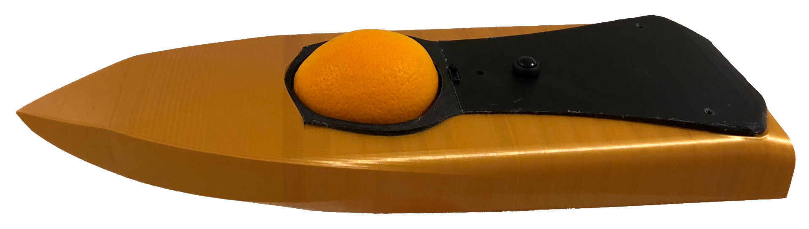
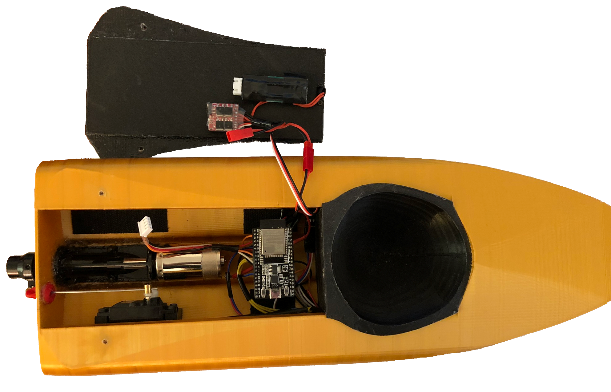
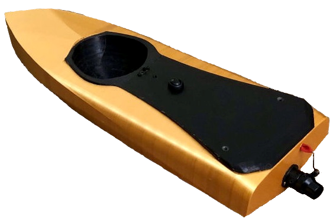

# N.O.A.H - "Navel Orange Autonomous Hauler" Boat
#### N.O.A.H is a 3D printed GPS guided speed boat created to carry a naval orange in the UCF G.N.O.R (Great Navel Orange Race) freshman engineering competition.
 
As of right now not all project file variants have not been organized for github and it is not recommended to copy the code for replication of the project.
The official deadline for the project has already passed and thus further development will be inconsistent and is not guaranteed.
This is merely a place holder for possible future work on this project for when I have time.
   

     

     

